# 苍穹之剑 - 智慧农业综合管理平台

<div align="center">

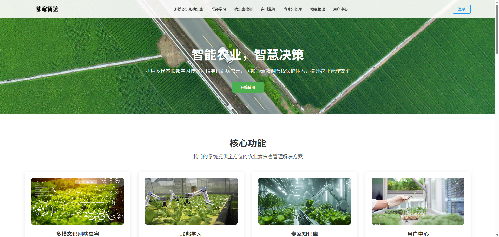

**基于 Vue 3 + Element Plus 的现代化智慧农业管理系统**

[](https://vuejs.org/)
[](https://element-plus.org/)
[](LICENSE)

[在线演示](#) | [项目文档](#) | [问题反馈](https://github.com/your-username/cangqiongzhijian-frontend/issues)

</div>

---

## 项目介绍

苍穹之剑是一个面向智慧农业的综合管理平台，旨在通过人工智能技术提升农业生产的智能化水平。项目名称"苍穹之剑"寓意着用科技之剑守护农业的蓝天，体现了我们对农业科技创新的追求。

### 项目背景

随着人工智能技术的快速发展，传统农业正面临着数字化转型的重要机遇。然而，农业生产中仍存在诸多挑战：
- 病虫害识别依赖人工经验，准确率有限
- 农业知识分散，缺乏系统化管理
- 地理信息数据利用不充分
- 数据孤岛问题阻碍了AI模型的优化

### 解决方案

苍穹之剑平台通过整合多种前沿技术，为智慧农业提供了一站式解决方案：

- **多模态识别技术** - 结合图像、文本等多种数据源，提供更准确的农业问题识别
- **联邦学习框架** - 在保护数据隐私的前提下，实现分布式AI模型训练
- **知识图谱系统** - 构建农业专业知识网络，提供智能问答服务
- **地理信息系统** - 实现农业区域的可视化管理和监控

### 技术特色

- **前端技术栈**：Vue 3 + Element Plus + ECharts + Leaflet
- **状态管理**：Pinia + Vuex
- **地图可视化**：Leaflet + 高德地图API
- **数据可视化**：ECharts + 词云图
- **代码规范**：ESLint + Prettier

---

## 项目特色

苍穹之剑是一个集成了**多模态识别**、**联邦学习**、**知识图谱**和**地理信息系统**的智慧农业综合管理平台。通过先进的人工智能技术，为农业生产提供全方位的智能化解决方案。

### 核心功能

- **智能检测系统** - 多模态图像识别与病虫害检测
- **联邦学习平台** - 分布式AI训练与性能对比
- **地理信息管理** - 农业区域监控与数据可视化
- **知识图谱系统** - 专家知识库与智能问答
- **用户权限管理** - 多级权限控制与个性化设置

---

## 功能展示

### 主界面与导航
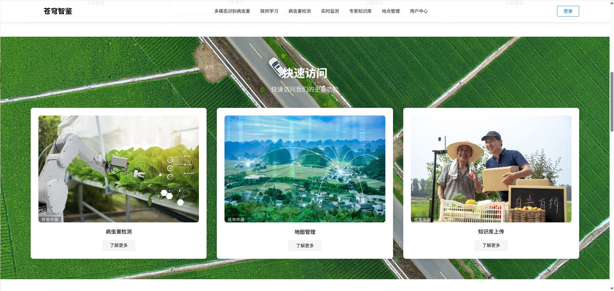

### 多模态识别系统
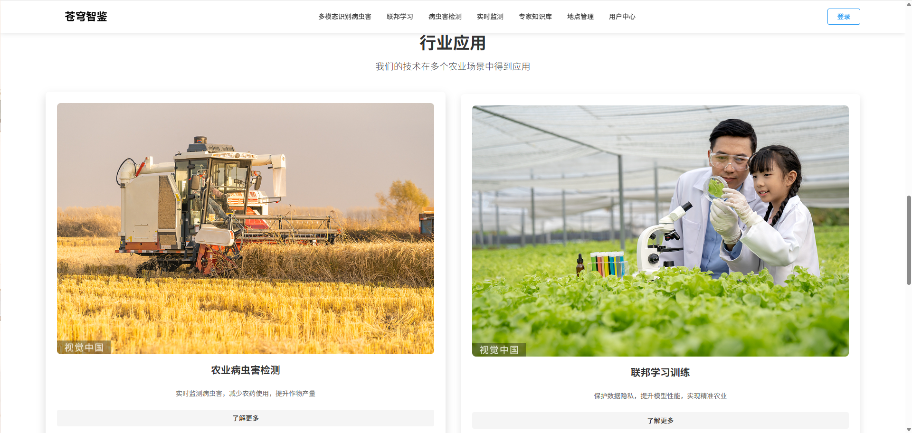

### 联邦学习训练状态
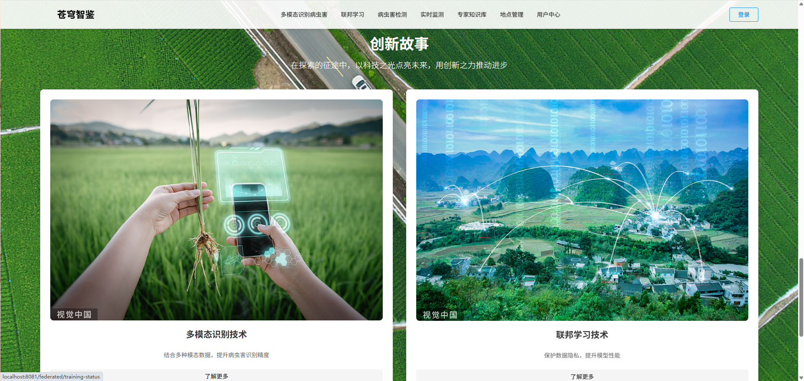

### 地理信息管理
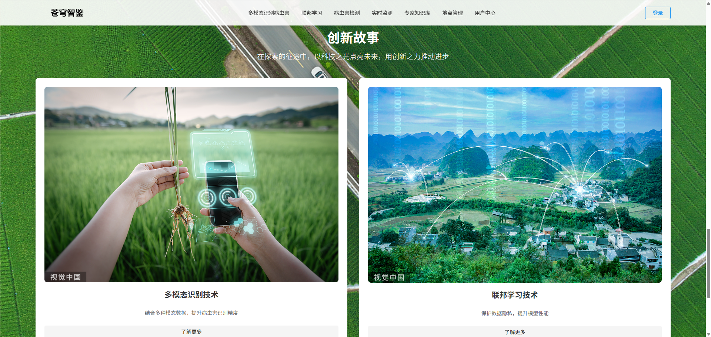

### 知识图谱问答
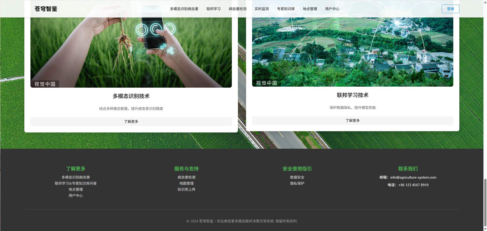

### 智能检测界面
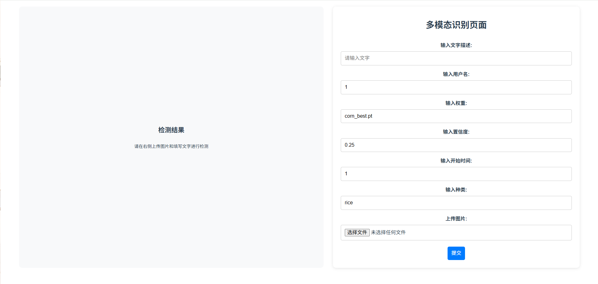

### 数据可视化
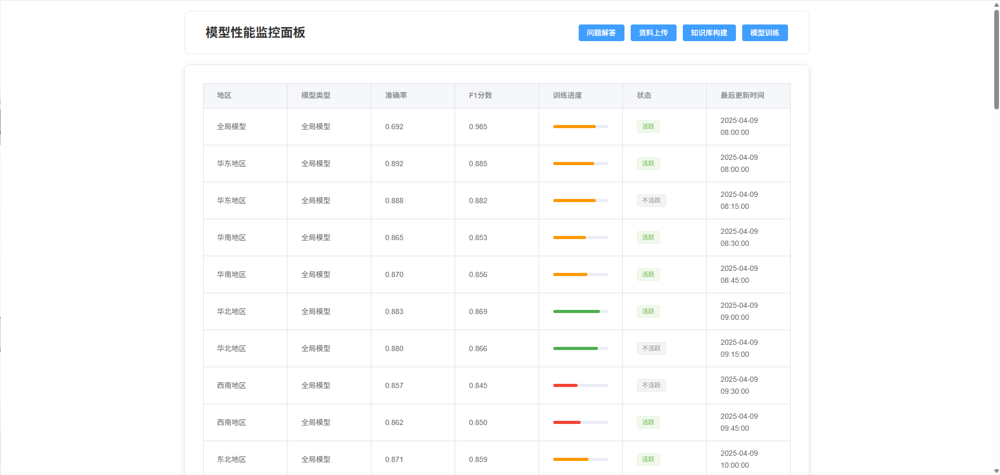

### 用户管理
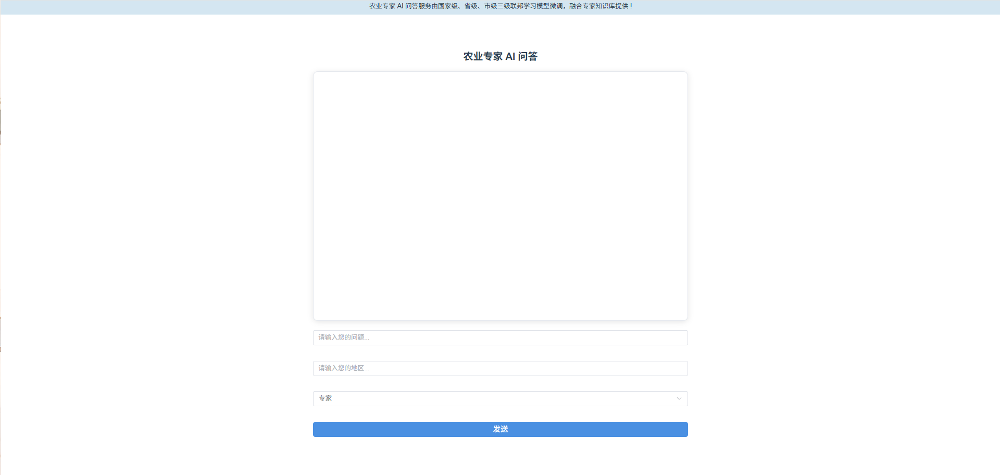

### 农业信息展示
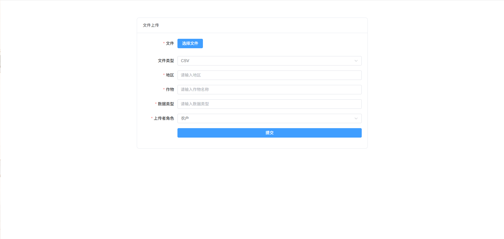

### 病虫害信息
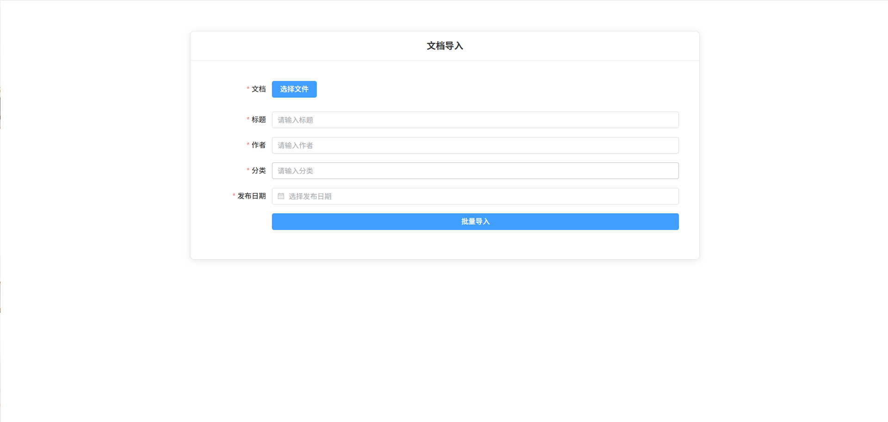

### 区域信息管理
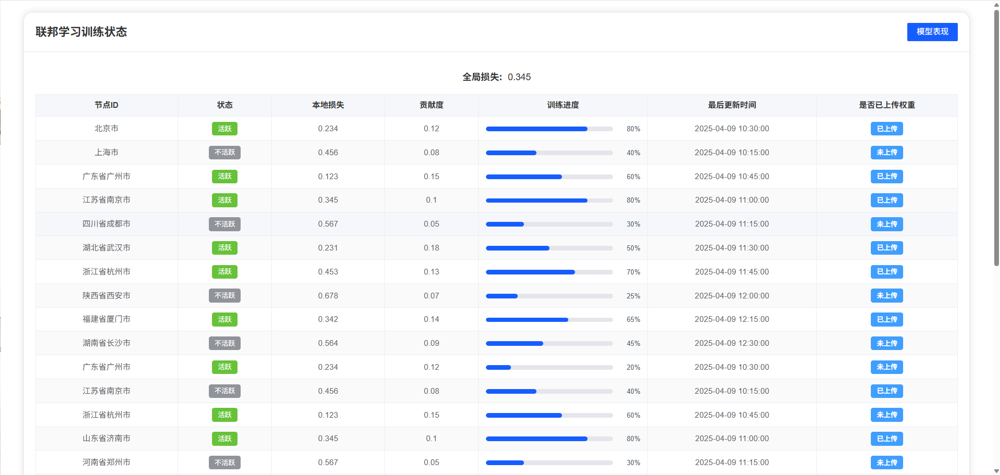

### 历史记录查看
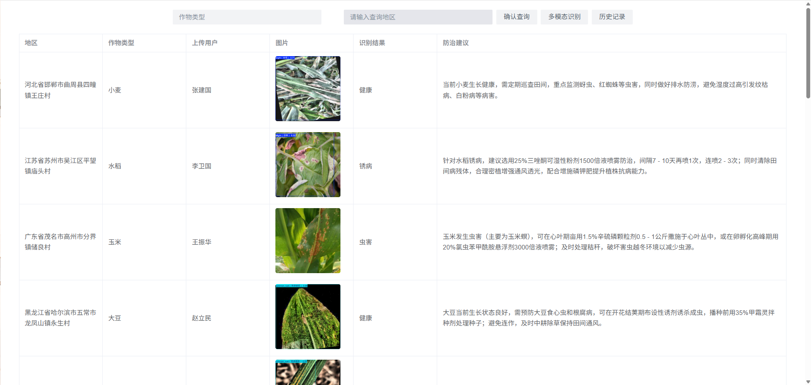

### 性能对比分析
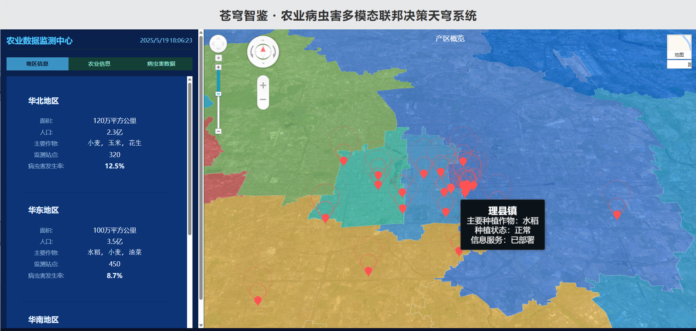

### 专家知识库
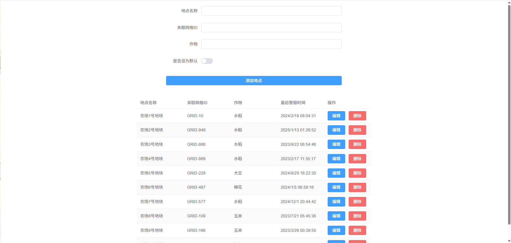

### 数据上传界面


---

## 快速开始

### 环境要求

- Node.js >= 16.0.0
- npm >= 8.0.0

### 安装步骤

1. **克隆项目**
```bash
git clone https://github.com/your-username/cangqiongzhijian-frontend.git
cd cangqiongzhijian-frontend
```

2. **安装依赖**
```bash
npm install
```

3. **启动开发服务器**
```bash
npm run serve
```

4. **构建生产版本**
```bash
npm run build
```

### 开发命令

```bash
# 启动开发服务器
npm run serve

# 构建生产版本
npm run build

# 代码检查
npm run lint
```

---

## 项目架构

### 技术栈

#### 前端技术
- **Vue 3** - 渐进式JavaScript框架
- **Element Plus** - 基于Vue 3的组件库
- **Vue Router 4** - 官方路由管理器
- **Pinia** - 新一代状态管理库
- **ECharts** - 数据可视化图表库
- **Leaflet** - 开源地图库
- **Axios** - HTTP客户端

#### 开发工具
- **Vue CLI** - Vue.js开发工具链
- **ESLint** - 代码质量检查
- **Prettier** - 代码格式化
- **Sass** - CSS预处理器

### 目录结构

```
cangqiongzhijian-frontend/
├── public/                 # 静态资源
│   ├── data/              # 地图数据
│   └── visionDetect/      # 视觉检测资源
├── src/
│   ├── api/               # API接口
│   │   ├── auth.js        # 认证相关
│   │   ├── detection.js   # 检测相关
│   │   ├── federated.js   # 联邦学习
│   │   ├── map.js         # 地图相关
│   │   └── user.js        # 用户相关
│   ├── assets/            # 静态资源
│   │   ├── image/         # 图片资源
│   │   └── styles/        # 样式文件
│   ├── components/        # 公共组件
│   ├── router/            # 路由配置
│   ├── stores/            # 状态管理
│   └── views/             # 页面组件
│       ├── auth/          # 认证页面
│       │   └── detection/ # 检测功能
│       ├── federated/     # 联邦学习
│       ├── knowledge/     # 知识图谱
│       ├── map/           # 地图管理
│       └── user/          # 用户管理
├── package.json           # 项目配置
└── vue.config.js          # Vue配置
```

---

## 功能模块

### 1. 智能检测系统
- **视觉检测** - 基于深度学习的图像识别
- **多模态识别** - 支持多种数据格式的智能分析
- **历史记录** - 检测结果的历史查询与管理
- **报告生成** - 自动生成检测分析报告

### 2. 联邦学习平台
- **训练状态监控** - 实时监控分布式训练进度
- **性能对比分析** - 多模型性能评估与对比
- **AI对话系统** - 智能问答与交互

### 3. 地理信息管理
- **地图可视化** - 基于Leaflet的交互式地图
- **农业信息展示** - 农作物分布与生长状态
- **病虫害信息** - 病虫害分布与预警
- **区域信息管理** - 农业区域数据管理

### 4. 知识图谱系统
- **数据上传** - 支持多种格式的知识数据导入
- **专家知识库** - 农业专家知识管理
- **智能问答** - 基于知识图谱的智能问答
- **知识看板** - 知识数据可视化展示

### 5. 用户权限管理
- **用户认证** - 登录注册功能
- **权限控制** - 基于角色的访问控制
- **个人设置** - 用户个性化配置
- **位置管理** - 用户位置信息管理

---

## 界面设计

项目采用现代化的设计理念，具有以下特点：

- **响应式设计** - 适配各种屏幕尺寸
- **直观的用户界面** - 简洁明了的操作流程
- **丰富的数据可视化** - 图表、地图等多种展示方式
- **统一的视觉风格** - 符合现代Web应用设计规范

---

## 贡献指南

我们欢迎所有形式的贡献，包括但不限于：

- 问题反馈
- 功能建议
- 文档改进
- 代码贡献

### 贡献步骤

1. Fork 本仓库
2. 创建特性分支 (`git checkout -b feature/AmazingFeature`)
3. 提交更改 (`git commit -m 'Add some AmazingFeature'`)
4. 推送到分支 (`git push origin feature/AmazingFeature`)
5. 开启 Pull Request

---

## 许可证

本项目采用 [MIT](LICENSE) 许可证 - 查看 [LICENSE](LICENSE) 文件了解详情。

---

## 致谢

感谢所有为这个项目做出贡献的开发者和用户！

- [Vue.js](https://vuejs.org/) - 渐进式JavaScript框架
- [Element Plus](https://element-plus.org/) - 基于Vue 3的组件库
- [ECharts](https://echarts.apache.org/) - 数据可视化图表库
- [Leaflet](https://leafletjs.com/) - 开源地图库

---

## 联系我们

- 项目地址：[https://github.com/your-username/cangqiongzhijian-frontend](https://github.com/your-username/cangqiongzhijian-frontend)
- 问题反馈：[Issues](https://github.com/your-username/cangqiongzhijian-frontend/issues)

---

<div align="center">

**如果这个项目对您有帮助，请给我们一个 Star！**

Made with ❤️ by [Your Name]

</div>
