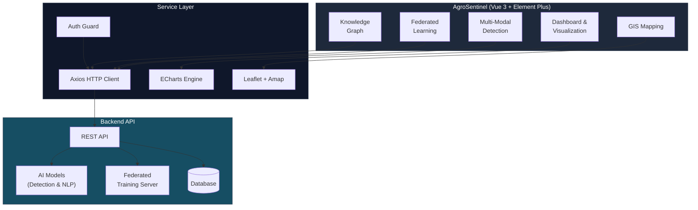
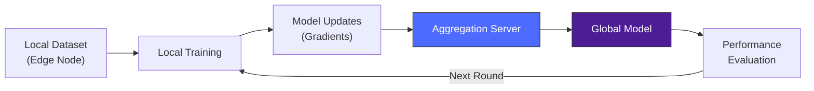

<div align="center">

# AgroSentinel

**AI-Powered Agricultural Ecosystem Monitoring Platform**

[](https://vuejs.org)
[](https://element-plus.org)
[](https://echarts.apache.org)
[](https://leafletjs.com)
[](LICENSE)

</div>

---

## Overview

AgroSentinel is an intelligent agricultural ecosystem monitoring platform that integrates **multi-modal recognition**, **federated learning**, **knowledge graphs**, and **GIS mapping** into a unified dashboard. Built with Vue 3 and modern web technologies, it provides real-time ecological monitoring, AI-powered crop disease detection, distributed model training, and expert knowledge Q&A — all through an intuitive visual interface.

---

## Architecture



### Federated Learning Pipeline



---

## Screenshots

### Main Dashboard


### Multi-Modal Recognition


### Federated Learning Monitor


### GIS Mapping & Ecological Zones


### Knowledge Graph Q&A


### Performance Analysis


<details>
<summary><strong>More Screenshots</strong></summary>

### Smart Detection Interface


### Data Visualization


### User Management


### Agricultural Information


### Pest & Disease Records


### Zone Management


### Detection History


### Expert Knowledge Base


### Data Upload


</details>

---

## Tech Stack

| Layer | Technology | Purpose |
|-------|-----------|---------|
| **Framework** | Vue 3 + Vue CLI 5 | Reactive UI with Composition API |
| **UI Library** | Element Plus 2.9 | Enterprise-grade component library |
| **State** | Pinia + Vuex | Global state management |
| **Routing** | Vue Router 4 | SPA navigation with auth guards |
| **Charts** | ECharts 5 + WordCloud | Data visualization & analytics |
| **Maps** | Leaflet + Amap SDK | Interactive GIS with geocoding |
| **HTTP** | Axios | REST API communication |
| **Styling** | Sass + Element Plus theme | Responsive modern design |

---

## Features

### Multi-Modal Detection
- Deep learning-based image recognition for crop diseases and ecological anomalies
- Support for multiple data formats (image, text, sensor data)
- Detection history tracking and report generation

### Federated Learning
- Distributed model training across edge nodes with privacy preservation
- Real-time training progress monitoring and convergence visualization
- Multi-model performance benchmarking and comparison

### Knowledge Graph
- Expert knowledge base for agricultural ecology
- Intelligent Q&A powered by graph-based reasoning
- Multi-format knowledge ingestion (upload & parse)
- Visual knowledge dashboard with word clouds

### GIS & Mapping
- Interactive map with Leaflet for ecological zone visualization
- Amap integration for geocoding and location services
- Agricultural distribution heatmaps and monitoring alerts
- Regional data management with multi-layer overlays

---

## Quick Start

### Prerequisites

- Node.js >= 16.0
- npm >= 8.0

### Install & Run

```bash
git clone https://github.com/Ei-Ayw/AgroSentinel.git
cd AgroSentinel

npm install
npm run serve
# Open http://localhost:8080
```

### Build for Production

```bash
npm run build
```

---

## Project Structure

```
AgroSentinel/
├── public/
│   ├── data/                  # Map data (GeoJSON)
│   └── visionDetect/         # Vision detection assets
├── src/
│   ├── api/                   # API service layer
│   │   ├── auth.js           # Authentication
│   │   ├── detection.js      # Detection endpoints
│   │   ├── federated.js      # Federated learning
│   │   ├── map.js            # GIS endpoints
│   │   └── user.js           # User management
│   ├── assets/               # Static resources & images
│   ├── components/           # Shared UI components
│   ├── router/               # Route definitions & guards
│   ├── stores/               # Pinia state stores
│   └── views/                # Page modules
│       ├── auth/             # Login & registration
│       │   └── detection/    # Detection features
│       ├── federated/        # Federated learning UI
│       ├── knowledge/        # Knowledge graph
│       ├── map/              # GIS management
│       └── user/             # User settings
├── docs/                     # Documentation & screenshots
├── package.json
└── vue.config.js
```

---

## License

This project is licensed under the [MIT License](LICENSE).
